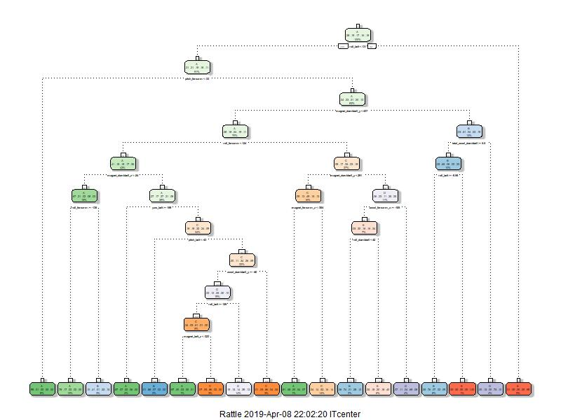
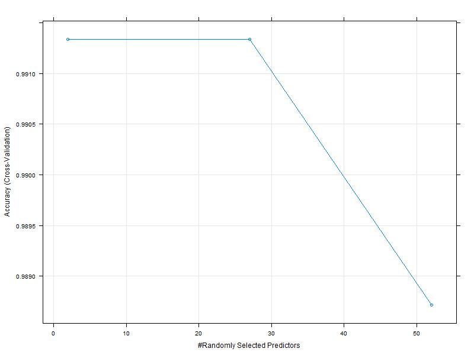
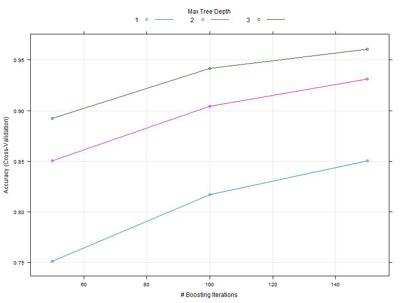

---
title: "Practical Machine Learning Project"
output: html_document
keep_md: true
--- 

## Introduction


Using devices such as Jawbone Up, Nike FuelBand, and Fitbit it is now possible to collect a large amount of data about personal activity relatively inexpensively. These type of devices are part of the quantified self movement - a group of enthusiasts who take measurements about themselves regularly to improve their health, to find patterns in their behavior, or because they are tech geeks. One thing that people regularly do is quantify how much of a particular activity they do, but they rarely quantify how well they do it. In this project, your goal will be to use data from accelerometers on the belt, forearm, arm, and dumbell of 6 participants. They were asked to perform barbell lifts correctly and incorrectly in 5 different ways

## Loading and preprocessing the data

```{r echo=TRUE }
library(rpart)
library(caret)

library(rpart.plot)
library(rattle)
library(randomForest)
fileTraing <- "https://d396qusza40orc.cloudfront.net/predmachlearn/pml-training.csv"
download.file(fileTraing, destfile = paste0(getwd(), '/pml-training.csv'))
fileTesting <- "https://d396qusza40orc.cloudfront.net/predmachlearn/pml-testing.csv"
download.file(fileTesting, destfile = paste0(getwd(), '/pml-testing.csv'))
```
    ## Warning: package 'caret' was built under R version 3.5.2
    ## Loading required package: lattice
    ## Loading required package: ggplot2
    ## Warning: package 'rpart.plot' was built under R version 3.5.2
    ## Warning: package 'rattle' was built under R version 3.5.2
    ## Rattle: A free graphical interface for data science with R.
    ## Version 5.2.0 Copyright (c) 2006-2018 Togaware Pty Ltd.
    ## Type 'rattle()' to shake, rattle, and roll your data.
    ## Warning: package 'randomForest' was built under R version 3.5.3
    ## randomForest 4.6-14
    ## Type rfNews() to see new features/changes/bug fixes.
    ## Attaching package: 'randomForest'
    ## The following object is masked from 'package:rattle':
    ##     importance
    ## The following object is masked from 'package:ggplot2':
    ##     margin

## Reading csv Data into Data.Table. 
```{r echo=TRUE}
traingSet <- read.csv("pml-training.csv")
testSet <- read.csv("pml-testing.csv")
```
  
### A summary of Data (traingSet)

```{r echo=TRUE, cache=TRUE}
str(traingSet)
colSums(is.na(traingSet))
```
      ## 'data.frame':    19622 obs. of  160 variables:
      ##  $ X                       : int  1 2 3 4 5 6 7 8 9 10 ...
      ##  $ user_name               : Factor w/ 6 levels "adelmo","carlitos",..: 2 2 2 2 2 2 2 2 2 2 ...
      ##  $ raw_timestamp_part_1    : int  1323084231 1323084231 1323084231 1323084232 1323084232 1323084232 1323084232 1323084232 1323084232 1323084232 ...
      ##  $ raw_timestamp_part_2    : int  788290 808298 820366 120339 196328 304277 368296 440390 484323 484434 ...
      ##  $ cvtd_timestamp          : Factor w/ 20 levels "02/12/2011 13:32",..: 9 9 9 9 9 9 9 9 9 9 ...
      ##  $ new_window              : Factor w/ 2 levels "no","yes": 1 1 1 1 1 1 1 1 1 1 ...
      ##  $ num_window              : int  11 11 11 12 12 12 12 12 12 12 ...
      ##  $ roll_belt               : num  1.41 1.41 1.42 1.48 1.48 1.45 1.42 1.42 1.43 1.45 ...
      ##  $ pitch_belt              : num  8.07 8.07 8.07 8.05 8.07 8.06 8.09 8.13 8.16 8.17 ...
      ##  $ yaw_belt                : num  -94.4 -94.4 -94.4 -94.4 -94.4 -94.4 -94.4 -94.4 -94.4 -94.4 ...
      ##  $ total_accel_belt        : int  3 3 3 3 3 3 3 3 3 3 ...
      ##  $ kurtosis_roll_belt      : Factor w/ 397 levels "","-0.016850",..: 1 1 1 1 1 1 1 1 1 1 ...
      ##  $ kurtosis_picth_belt     : Factor w/ 317 levels "","-0.021887",..: 1 1 1 1 1 1 1 1 1 1 ...
      ##  $ kurtosis_yaw_belt       : Factor w/ 2 levels "","#DIV/0!": 1 1 1 1 1 1 1 1 1 1 ...
      ##  $ skewness_roll_belt      : Factor w/ 395 levels "","-0.003095",..: 1 1 1 1 1 1 1 1 1 1 ...
      ##  $ skewness_roll_belt.1    : Factor w/ 338 levels "","-0.005928",..: 1 1 1 1 1 1 1 1 1 1 ...
      ##  $ skewness_yaw_belt       : Factor w/ 2 levels "","#DIV/0!": 1 1 1 1 1 1 1 1 1 1 ...
      ##  $ max_roll_belt           : num  NA NA NA NA NA NA NA NA NA NA ...
      ##  $ max_picth_belt          : int  NA NA NA NA NA NA NA NA NA NA ...
      ##  $ max_yaw_belt            : Factor w/ 68 levels "","-0.1","-0.2",..: 1 1 1 1 1 1 1 1 1 1 ...
      ##  $ min_roll_belt           : num  NA NA NA NA NA NA NA NA NA NA ...
      ##  $ min_pitch_belt          : int  NA NA NA NA NA NA NA NA NA NA ...
      ##  $ min_yaw_belt            : Factor w/ 68 levels "","-0.1","-0.2",..: 1 1 1 1 1 1 1 1 1 1 ...
      ##  $ amplitude_roll_belt     : num  NA NA NA NA NA NA NA NA NA NA ...
      ##  $ amplitude_pitch_belt    : int  NA NA NA NA NA NA NA NA NA NA ...
      ##  $ amplitude_yaw_belt      : Factor w/ 4 levels "","#DIV/0!","0.00",..: 1 1 1 1 1 1 1 1 1 1 ...
      ##  $ var_total_accel_belt    : num  NA NA NA NA NA NA NA NA NA NA ...
      ##  $ avg_roll_belt           : num  NA NA NA NA NA NA NA NA NA NA ...
      ##  $ stddev_roll_belt        : num  NA NA NA NA NA NA NA NA NA NA ...
      ##  $ var_roll_belt           : num  NA NA NA NA NA NA NA NA NA NA ...
      ##  $ avg_pitch_belt          : num  NA NA NA NA NA NA NA NA NA NA ...
      ##  $ stddev_pitch_belt       : num  NA NA NA NA NA NA NA NA NA NA ...
      ##  $ var_pitch_belt          : num  NA NA NA NA NA NA NA NA NA NA ...
      ##  $ avg_yaw_belt            : num  NA NA NA NA NA NA NA NA NA NA ...
      ##  $ stddev_yaw_belt         : num  NA NA NA NA NA NA NA NA NA NA ...
      ##  $ var_yaw_belt            : num  NA NA NA NA NA NA NA NA NA NA ...
      ##  $ gyros_belt_x            : num  0 0.02 0 0.02 0.02 0.02 0.02 0.02 0.02 0.03 ...
      ##  $ gyros_belt_y            : num  0 0 0 0 0.02 0 0 0 0 0 ...
      ##  $ gyros_belt_z            : num  -0.02 -0.02 -0.02 -0.03 -0.02 -0.02 -0.02 -0.02 -0.02 0 ...
      ##  $ accel_belt_x            : int  -21 -22 -20 -22 -21 -21 -22 -22 -20 -21 ...
      ##  $ accel_belt_y            : int  4 4 5 3 2 4 3 4 2 4 ...
      ##  $ accel_belt_z            : int  22 22 23 21 24 21 21 21 24 22 ...
      ##  $ magnet_belt_x           : int  -3 -7 -2 -6 -6 0 -4 -2 1 -3 ...
      ##  $ magnet_belt_y           : int  599 608 600 604 600 603 599 603 602 609 ...
      ##  $ magnet_belt_z           : int  -313 -311 -305 -310 -302 -312 -311 -313 -312 -308 ...
      ##  $ roll_arm                : num  -128 -128 -128 -128 -128 -128 -128 -128 -128 -128 ...
      ##  $ pitch_arm               : num  22.5 22.5 22.5 22.1 22.1 22 21.9 21.8 21.7 21.6 ...
      ##  $ yaw_arm                 : num  -161 -161 -161 -161 -161 -161 -161 -161 -161 -161 ...
      ##  $ total_accel_arm         : int  34 34 34 34 34 34 34 34 34 34 ...
      ##  $ var_accel_arm           : num  NA NA NA NA NA NA NA NA NA NA ...
      ##  $ avg_roll_arm            : num  NA NA NA NA NA NA NA NA NA NA ...
      ##  $ stddev_roll_arm         : num  NA NA NA NA NA NA NA NA NA NA ...
      ##  $ var_roll_arm            : num  NA NA NA NA NA NA NA NA NA NA ...
      ##  $ avg_pitch_arm           : num  NA NA NA NA NA NA NA NA NA NA ...
      ##  $ stddev_pitch_arm        : num  NA NA NA NA NA NA NA NA NA NA ...
      ##  $ var_pitch_arm           : num  NA NA NA NA NA NA NA NA NA NA ...
      ##  $ avg_yaw_arm             : num  NA NA NA NA NA NA NA NA NA NA ...
      ##  $ stddev_yaw_arm          : num  NA NA NA NA NA NA NA NA NA NA ...
      ##  $ var_yaw_arm             : num  NA NA NA NA NA NA NA NA NA NA ...
      ##  $ gyros_arm_x             : num  0 0.02 0.02 0.02 0 0.02 0 0.02 0.02 0.02 ...
      ##  $ gyros_arm_y             : num  0 -0.02 -0.02 -0.03 -0.03 -0.03 -0.03 -0.02 -0.03 -0.03 ...
      ##  $ gyros_arm_z             : num  -0.02 -0.02 -0.02 0.02 0 0 0 0 -0.02 -0.02 ...
      ##  $ accel_arm_x             : int  -288 -290 -289 -289 -289 -289 -289 -289 -288 -288 ...
      ##  $ accel_arm_y             : int  109 110 110 111 111 111 111 111 109 110 ...
      ##  $ accel_arm_z             : int  -123 -125 -126 -123 -123 -122 -125 -124 -122 -124 ...
      ##  $ magnet_arm_x            : int  -368 -369 -368 -372 -374 -369 -373 -372 -369 -376 ...
      ##  $ magnet_arm_y            : int  337 337 344 344 337 342 336 338 341 334 ...
      ##  $ magnet_arm_z            : int  516 513 513 512 506 513 509 510 518 516 ...
      ##  $ kurtosis_roll_arm       : Factor w/ 330 levels "","-0.02438",..: 1 1 1 1 1 1 1 1 1 1 ...
      ##  $ kurtosis_picth_arm      : Factor w/ 328 levels "","-0.00484",..: 1 1 1 1 1 1 1 1 1 1 ...
      ##  $ kurtosis_yaw_arm        : Factor w/ 395 levels "","-0.01548",..: 1 1 1 1 1 1 1 1 1 1 ...
      ##  $ skewness_roll_arm       : Factor w/ 331 levels "","-0.00051",..: 1 1 1 1 1 1 1 1 1 1 ...
      ##  $ skewness_pitch_arm      : Factor w/ 328 levels "","-0.00184",..: 1 1 1 1 1 1 1 1 1 1 ...
      ##  $ skewness_yaw_arm        : Factor w/ 395 levels "","-0.00311",..: 1 1 1 1 1 1 1 1 1 1 ...
      ##  $ max_roll_arm            : num  NA NA NA NA NA NA NA NA NA NA ...
      ##  $ max_picth_arm           : num  NA NA NA NA NA NA NA NA NA NA ...
      ##  $ max_yaw_arm             : int  NA NA NA NA NA NA NA NA NA NA ...
      ##  $ min_roll_arm            : num  NA NA NA NA NA NA NA NA NA NA ...
      ##  $ min_pitch_arm           : num  NA NA NA NA NA NA NA NA NA NA ...
      ##  $ min_yaw_arm             : int  NA NA NA NA NA NA NA NA NA NA ...
      ##  $ amplitude_roll_arm      : num  NA NA NA NA NA NA NA NA NA NA ...
      ##  $ amplitude_pitch_arm     : num  NA NA NA NA NA NA NA NA NA NA ...
      ##  $ amplitude_yaw_arm       : int  NA NA NA NA NA NA NA NA NA NA ...
      ##  $ roll_dumbbell           : num  13.1 13.1 12.9 13.4 13.4 ...
      ##  $ pitch_dumbbell          : num  -70.5 -70.6 -70.3 -70.4 -70.4 ...
      ##  $ yaw_dumbbell            : num  -84.9 -84.7 -85.1 -84.9 -84.9 ...
      ##  $ kurtosis_roll_dumbbell  : Factor w/ 398 levels "","-0.0035","-0.0073",..: 1 1 1 1 1 1 1 1 1 1 ...
      ##  $ kurtosis_picth_dumbbell : Factor w/ 401 levels "","-0.0163","-0.0233",..: 1 1 1 1 1 1 1 1 1 1 ...
      ##  $ kurtosis_yaw_dumbbell   : Factor w/ 2 levels "","#DIV/0!": 1 1 1 1 1 1 1 1 1 1 ...
      ##  $ skewness_roll_dumbbell  : Factor w/ 401 levels "","-0.0082","-0.0096",..: 1 1 1 1 1 1 1 1 1 1 ...
      ##  $ skewness_pitch_dumbbell : Factor w/ 402 levels "","-0.0053","-0.0084",..: 1 1 1 1 1 1 1 1 1 1 ...
      ##  $ skewness_yaw_dumbbell   : Factor w/ 2 levels "","#DIV/0!": 1 1 1 1 1 1 1 1 1 1 ...
      ##  $ max_roll_dumbbell       : num  NA NA NA NA NA NA NA NA NA NA ...
      ##  $ max_picth_dumbbell      : num  NA NA NA NA NA NA NA NA NA NA ...
      ##  $ max_yaw_dumbbell        : Factor w/ 73 levels "","-0.1","-0.2",..: 1 1 1 1 1 1 1 1 1 1 ...
      ##  $ min_roll_dumbbell       : num  NA NA NA NA NA NA NA NA NA NA ...
      ##  $ min_pitch_dumbbell      : num  NA NA NA NA NA NA NA NA NA NA ...
      ##  $ min_yaw_dumbbell        : Factor w/ 73 levels "","-0.1","-0.2",..: 1 1 1 1 1 1 1 1 1 1 ...
      ##  $ amplitude_roll_dumbbell : num  NA NA NA NA NA NA NA NA NA NA ...
      ##   [list output truncated]


      #                        X                user_name     raw_timestamp_part_1 
      ##                        0                        0                        0 
      ##     raw_timestamp_part_2           cvtd_timestamp               new_window 
      ##                        0                        0                        0 
      ##               num_window                roll_belt               pitch_belt 
      ##                        0                        0                        0 
      ##                 yaw_belt         total_accel_belt       kurtosis_roll_belt 
      ##                        0                        0                        0 
      ##      kurtosis_picth_belt        kurtosis_yaw_belt       skewness_roll_belt 
      ##                        0                        0                        0 
      ##     skewness_roll_belt.1        skewness_yaw_belt            max_roll_belt 
      ##                        0                        0                    19216 
      ##           max_picth_belt             max_yaw_belt            min_roll_belt 
      ##                    19216                        0                    19216 
      ##           min_pitch_belt             min_yaw_belt      amplitude_roll_belt 
      ##                    19216                        0                    19216 
      ##     amplitude_pitch_belt       amplitude_yaw_belt     var_total_accel_belt 
      ##                    19216                        0                    19216 
      ##            avg_roll_belt         stddev_roll_belt            var_roll_belt 
      ##                    19216                    19216                    19216 
      ##           avg_pitch_belt        stddev_pitch_belt           var_pitch_belt 
      ##                    19216                    19216                    19216 
      ##             avg_yaw_belt          stddev_yaw_belt             var_yaw_belt 
      ##                    19216                    19216                    19216 
      ##             gyros_belt_x             gyros_belt_y             gyros_belt_z 
      ##                        0                        0                        0 
      ##             accel_belt_x             accel_belt_y             accel_belt_z 
      ##                        0                        0                        0 
      ##            magnet_belt_x            magnet_belt_y            magnet_belt_z 
      ##                        0                        0                        0 
      ##                 roll_arm                pitch_arm                  yaw_arm 
      ##                        0                        0                        0 
      ##          total_accel_arm            var_accel_arm             avg_roll_arm 
      ##                        0                    19216                    19216 
      ##          stddev_roll_arm             var_roll_arm            avg_pitch_arm 
      ##                    19216                    19216                    19216 
      ##         stddev_pitch_arm            var_pitch_arm              avg_yaw_arm 
      ##                    19216                    19216                    19216 
      ##           stddev_yaw_arm              var_yaw_arm              gyros_arm_x 
      ##                    19216                    19216                        0 
      ##              gyros_arm_y              gyros_arm_z              accel_arm_x 
      ##                        0                        0                        0 
      ##              accel_arm_y              accel_arm_z             magnet_arm_x 
      ##                        0                        0                        0 
      ##             magnet_arm_y             magnet_arm_z        kurtosis_roll_arm 
      ##                        0                        0                        0 
      ##       kurtosis_picth_arm         kurtosis_yaw_arm        skewness_roll_arm 
      ##                        0                        0                        0 
      ##       skewness_pitch_arm         skewness_yaw_arm             max_roll_arm 
      ##                        0                        0                    19216 
      ##            max_picth_arm              max_yaw_arm             min_roll_arm 
      ##                    19216                    19216                    19216 
      ##            min_pitch_arm              min_yaw_arm       amplitude_roll_arm 
      ##                    19216                    19216                    19216 
      ##      amplitude_pitch_arm        amplitude_yaw_arm            roll_dumbbell 
      ##                    19216                    19216                        0 
      ##           pitch_dumbbell             yaw_dumbbell   kurtosis_roll_dumbbell 
      ##                        0                        0                        0 
      ##  kurtosis_picth_dumbbell    kurtosis_yaw_dumbbell   skewness_roll_dumbbell 
      ##                        0                        0                        0 
      ##  skewness_pitch_dumbbell    skewness_yaw_dumbbell        max_roll_dumbbell 
      ##                        0                        0                    19216 
      ##       max_picth_dumbbell         max_yaw_dumbbell        min_roll_dumbbell 
      ##                    19216                        0                    19216 
      ##       min_pitch_dumbbell         min_yaw_dumbbell  amplitude_roll_dumbbell 
      ##                    19216                        0                    19216 
      ## amplitude_pitch_dumbbell   amplitude_yaw_dumbbell     total_accel_dumbbell 
      ##                    19216                        0                        0 
      ##       var_accel_dumbbell        avg_roll_dumbbell     stddev_roll_dumbbell 
      ##                    19216                    19216                    19216 
      ##        var_roll_dumbbell       avg_pitch_dumbbell    stddev_pitch_dumbbell 
      ##                    19216                    19216                    19216 
      ##       var_pitch_dumbbell         avg_yaw_dumbbell      stddev_yaw_dumbbell 
      ##                    19216                    19216                    19216 
      ##         var_yaw_dumbbell         gyros_dumbbell_x         gyros_dumbbell_y 
      ##                    19216                        0                        0 
      ##         gyros_dumbbell_z         accel_dumbbell_x         accel_dumbbell_y 
      ##                        0                        0                        0 
      ##         accel_dumbbell_z        magnet_dumbbell_x        magnet_dumbbell_y 
      ##                        0                        0                        0 
      ##        magnet_dumbbell_z             roll_forearm            pitch_forearm 
      ##                        0                        0                        0 
      ##              yaw_forearm    kurtosis_roll_forearm   kurtosis_picth_forearm 
      ##                        0                        0                        0 
      ##     kurtosis_yaw_forearm    skewness_roll_forearm   skewness_pitch_forearm 
      ##                        0                        0                        0 
      ##     skewness_yaw_forearm         max_roll_forearm        max_picth_forearm 
      ##                        0                    19216                    19216 
      ##          max_yaw_forearm         min_roll_forearm        min_pitch_forearm 
      ##                        0                    19216                    19216 
      ##          min_yaw_forearm   amplitude_roll_forearm  amplitude_pitch_forearm 
      ##                        0                    19216                    19216 
      ##    amplitude_yaw_forearm      total_accel_forearm        var_accel_forearm 
      ##                        0                        0                    19216 
      ##         avg_roll_forearm      stddev_roll_forearm         var_roll_forearm 
      ##                    19216                    19216                    19216 
      ##        avg_pitch_forearm     stddev_pitch_forearm        var_pitch_forearm 
      ##                    19216                    19216                    19216 
      ##          avg_yaw_forearm       stddev_yaw_forearm          var_yaw_forearm 
      ##                    19216                    19216                    19216 
      ##          gyros_forearm_x          gyros_forearm_y          gyros_forearm_z 
      ##                        0                        0                        0 
      ##          accel_forearm_x          accel_forearm_y          accel_forearm_z 
      ##                        0                        0                        0 
      ##         magnet_forearm_x         magnet_forearm_y         magnet_forearm_z 
      ##                        0                        0                        0 
      ##                   classe 
      ##                        0

The training data set is made of 19622 observations on 160 columns. We can notice that many columns have NA values or blank values on almost every observation. So we will remove them.

## Cleaning the input data

```{r echo=TRUE}
traingSet <- traingSet[, colSums(is.na(traingSet))==0]
testSet <- testSet[, colSums(is.na(testSet))==0]
```
also we wil remove first sever colmns which contain information for people who did the test, and also timestamps

```{r echo=TRUE}
traingSet <- traingSet[, -c(1:7)]
testSet <- testSet[, -c(1:7)]
```

## Preparing the datasets for prediction. 

```{r echo=TRUE}
set.seed(1234)
inTrain <- createDataPartition(traingSet$classe,p =0.7,list = FALSE)
trainData <- traingSet[inTrain, ]
testData <- traingSet[-inTrain, ]
```


## Cleaning the variables that are near-zero-variance
```{r echo=TRUE}
near_zero <- nearZeroVar(testData)
trainData <- trainData[,-near_zero]
testData <- testData[,-near_zero]
```

## Prediction with classification trees
```{r echo=TRUE}
set.seed(12345)
DessTree <-rpart(classe ~ ., data=trainData,method="class")
fancyRpartPlot(DessTree)
```
 


## Prediction on Test dataset
```{r echo=TRUE}
predTreeDess <- predict(DessTree,newdata = testData,type="class")
cofMatTreeDess <- confusionMatrix(predTreeDess,testData$classe)
cofMatTreeDess
```
      ## Confusion Matrix and Statistics
      ## 
      ##           Reference
      ## Prediction    A    B    C    D    E
      ##          A 1364  169   24   48   16
      ##          B   60  581   46   79   74
      ##          C   52  137  765  129  145
      ##          D  183  194  125  650  159
      ##          E   15   58   66   58  688
      ## 
      ## Overall Statistics
      ##                                           
      ##                Accuracy : 0.6879          
      ##                  95% CI : (0.6758, 0.6997)
      ##     No Information Rate : 0.2845          
      ##     P-Value [Acc > NIR] : < 2.2e-16       
      ##                                           
      ##                   Kappa : 0.6066          
      ##  Mcnemar's Test P-Value : < 2.2e-16       
      ## 
      ## Statistics by Class:
      ## 
      ##                      Class: A Class: B Class: C Class: D Class: E
      ## Sensitivity            0.8148  0.51010   0.7456   0.6743   0.6359
      ## Specificity            0.9390  0.94543   0.9047   0.8657   0.9590
      ## Pos Pred Value         0.8415  0.69167   0.6230   0.4958   0.7774
      ## Neg Pred Value         0.9273  0.88940   0.9440   0.9314   0.9212
      ## Prevalence             0.2845  0.19354   0.1743   0.1638   0.1839
      ## Detection Rate         0.2318  0.09873   0.1300   0.1105   0.1169
      ## Detection Prevalence   0.2754  0.14274   0.2087   0.2228   0.1504
      ## Balanced Accuracy      0.8769  0.72776   0.8252   0.7700   0.7974
  
We see that the accuracy rate of the model is low: 0.6967.

## Train with random forests

```{r echo=TRUE}
tcontrol <- trainControl(method = "cv", number = 5)
model_RF <- train(classe ~., data = trainData, method = "rf", trControl = tcontrol)
model_RF$finalModel
```

    ## 
    ## Call:
    ##  randomForest(x = x, y = y, mtry = param$mtry) 
    ##                Type of random forest: classification
    ##                      Number of trees: 500
    ## No. of variables tried at each split: 27
    ## 
    ##         OOB estimate of  error rate: 0.55%
    ## Confusion matrix:
    ##      A    B    C    D    E class.error
    ## A 3901    3    1    0    1 0.001280082
    ## B   17 2636    5    0    0 0.008276900
    ## C    0    9 2382    5    0 0.005843072
    ## D    0    0   21 2230    1 0.009769094
    ## E    0    2    3    7 2513 0.004752475
```{r echo=TRUE}
predict_rf <- predict(model_RF,newdata = testData)
confMatrix_rf <- confusionMatrix(predict_rf,testData$classe)
confMatrix_rf
```
    ## Confusion Matrix and Statistics
    ## 
    ##           Reference
    ## Prediction    A    B    C    D    E
    ##          A 1674   11    0    0    0
    ##          B    0 1127    4    2    1
    ##          C    0    1 1018    5    2
    ##          D    0    0    4  956    3
    ##          E    0    0    0    1 1076
    ## 
    ## Overall Statistics
    ##                                          
    ##                Accuracy : 0.9942         
    ##                  95% CI : (0.9919, 0.996)
    ##     No Information Rate : 0.2845         
    ##     P-Value [Acc > NIR] : < 2.2e-16      
    ##                                          
    ##                   Kappa : 0.9927         
    ##  Mcnemar's Test P-Value : NA             
    ## 
    ## Statistics by Class:
    ## 
    ##                      Class: A Class: B Class: C Class: D Class: E
    ## Sensitivity            1.0000   0.9895   0.9922   0.9917   0.9945
    ## Specificity            0.9974   0.9985   0.9984   0.9986   0.9998
    ## Pos Pred Value         0.9935   0.9938   0.9922   0.9927   0.9991
    ## Neg Pred Value         1.0000   0.9975   0.9984   0.9984   0.9988
    ## Prevalence             0.2845   0.1935   0.1743   0.1638   0.1839
    ## Detection Rate         0.2845   0.1915   0.1730   0.1624   0.1828
    ## Detection Prevalence   0.2863   0.1927   0.1743   0.1636   0.1830
    ## Balanced Accuracy      0.9987   0.9940   0.9953   0.9951   0.9971

  
With random forest, we reach an accuracy of 99.3% using cross-validation with 5 steps

### let's plot the model 
```{r echo=TRUE}
plot(model_RF)

```
 

## Train with gradient boosting method

```{r echo=TRUE}
model_GBM <- train(classe~., data=trainData, method="gbm", trControl=tcontrol, verbose=FALSE)
print(model_GBM)
```

    ## Stochastic Gradient Boosting 
    ## 
    ## 13737 samples
    ##    52 predictor
    ##     5 classes: 'A', 'B', 'C', 'D', 'E' 
    ## 
    ## No pre-processing
    ## Resampling: Cross-Validated (5 fold) 
    ## Summary of sample sizes: 10989, 10990, 10989, 10991, 10989 
    ## Resampling results across tuning parameters:
    ## 
    ##   interaction.depth  n.trees  Accuracy   Kappa    
    ##   1                   50      0.7511821  0.6847638
    ##   1                  100      0.8172084  0.7687559
    ##   1                  150      0.8502588  0.8105811
    ##   2                   50      0.8506942  0.8108627
    ##   2                  100      0.9044190  0.8790402
    ##   2                  150      0.9310621  0.9127675
    ##   3                   50      0.8922615  0.8635523
    ##   3                  100      0.9418354  0.9263907
    ##   3                  150      0.9607629  0.9503517
    ## 
    ## Tuning parameter 'shrinkage' was held constant at a value of 0.1
    ## 
    ## Tuning parameter 'n.minobsinnode' was held constant at a value of 10
    ## Accuracy was used to select the optimal model using the largest value.
    ## The final values used for the model were n.trees = 150,
    ##  interaction.depth = 3, shrinkage = 0.1 and n.minobsinnode = 10.

### let's plot the model 

```{r echo=TRUE}

plot(model_GBM)

```
 


```{r echo=TRUE}
train_GBM <- predict(model_GBM,newdata=testData)
confMatGBM <- confusionMatrix(testData$classe,train_GBM)
confMatGBM
```
    ## Confusion Matrix and Statistics
    ## 
    ##           Reference
    ## Prediction    A    B    C    D    E
    ##          A 1652   14    3    4    1
    ##          B   48 1066   24    0    1
    ##          C    0   34  980   10    2
    ##          D    0    5   20  928   11
    ##          E    0   14    8   17 1043
    ## 
    ## Overall Statistics
    ##                                          
    ##                Accuracy : 0.9633         
    ##                  95% CI : (0.9582, 0.968)
    ##     No Information Rate : 0.2889         
    ##     P-Value [Acc > NIR] : < 2.2e-16      
    ##                                          
    ##                   Kappa : 0.9535         
    ##  Mcnemar's Test P-Value : 7.922e-08      
    ## 
    ## Statistics by Class:
    ## 
    ##                      Class: A Class: B Class: C Class: D Class: E
    ## Sensitivity            0.9718   0.9409   0.9469   0.9677   0.9858
    ## Specificity            0.9947   0.9846   0.9905   0.9927   0.9919
    ## Pos Pred Value         0.9869   0.9359   0.9552   0.9627   0.9640
    ## Neg Pred Value         0.9886   0.9859   0.9887   0.9937   0.9969
    ## Prevalence             0.2889   0.1925   0.1759   0.1630   0.1798
    ## Detection Rate         0.2807   0.1811   0.1665   0.1577   0.1772
    ## Detection Prevalence   0.2845   0.1935   0.1743   0.1638   0.1839
    ## Balanced Accuracy      0.9833   0.9628   0.9687   0.9802   0.9889

## Applying the best model to the validation data
  
The accuracy of the 3 regression modeling methods above are:

Random Forest : 0.9942

Decision Tree : 0.6879

GBM : 0.9633

In that case, the Random Forest model will be applied to predict  (testing dataset) :

```{r echo=TRUE}
predictTEST <- predict(model_RF, newdata=testSet)
predictTEST
```
    ##  [1] B A B A A E D B A A B C B A E E A B B B
    ## Levels: A B C D
